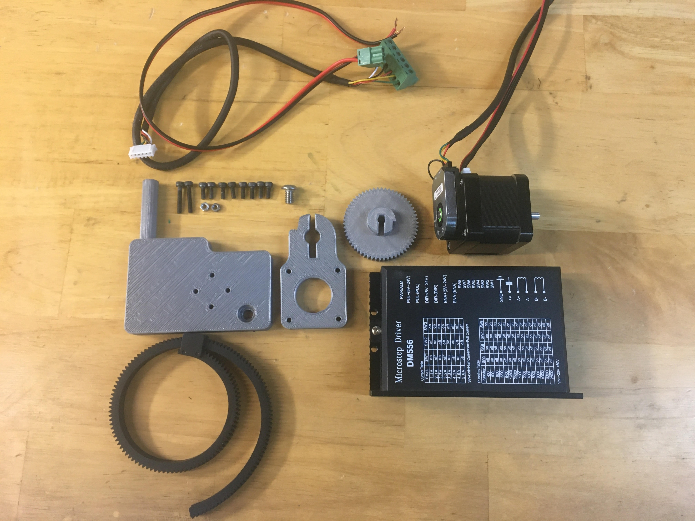
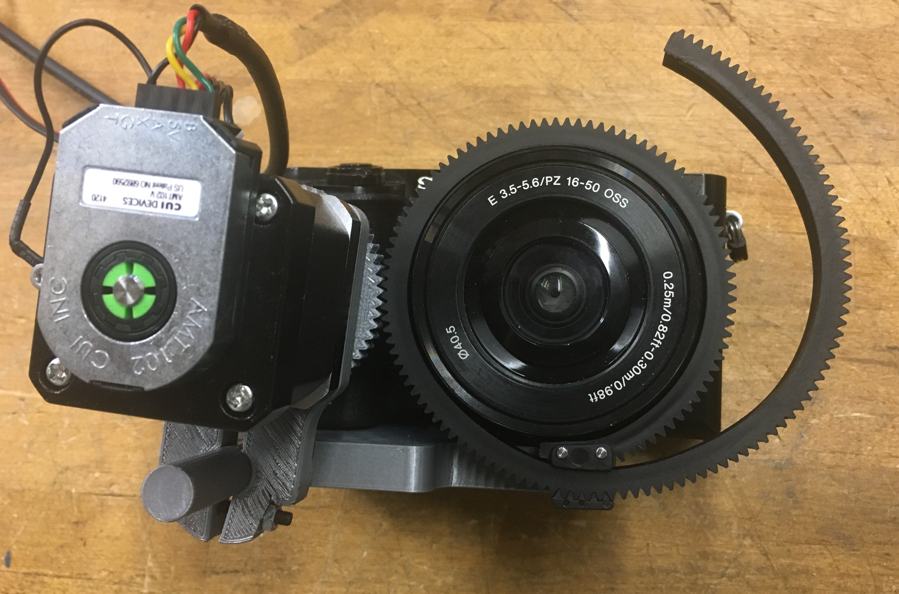

# Adding Degrees of Freedom using a Camera and Rail

<a href="https://youtu.be/N5IlFthJBqI">Link to Youtube video</a>

In this document we will showcase the Dorna 2's ability to add multiple degrees of freedom. We will go over the construction and the application of the camera attachment and railing.

## Camera Attachment

### Construction

### Application

## Railing

### Application

