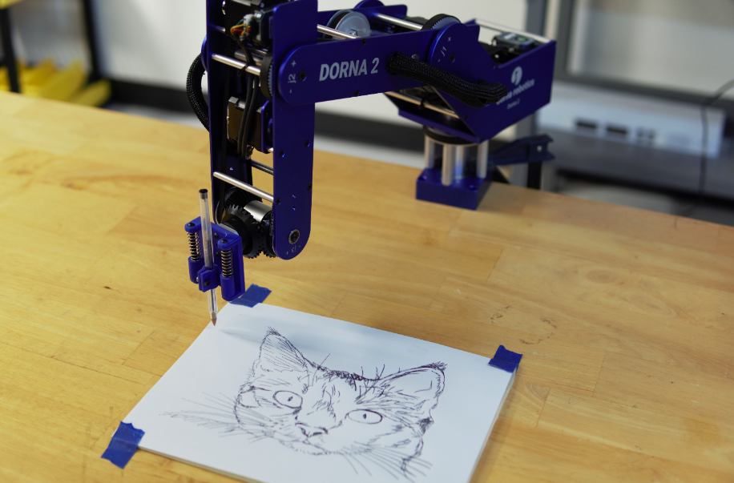
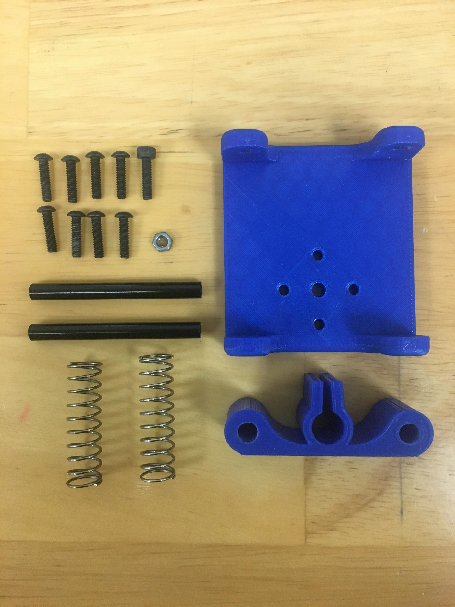
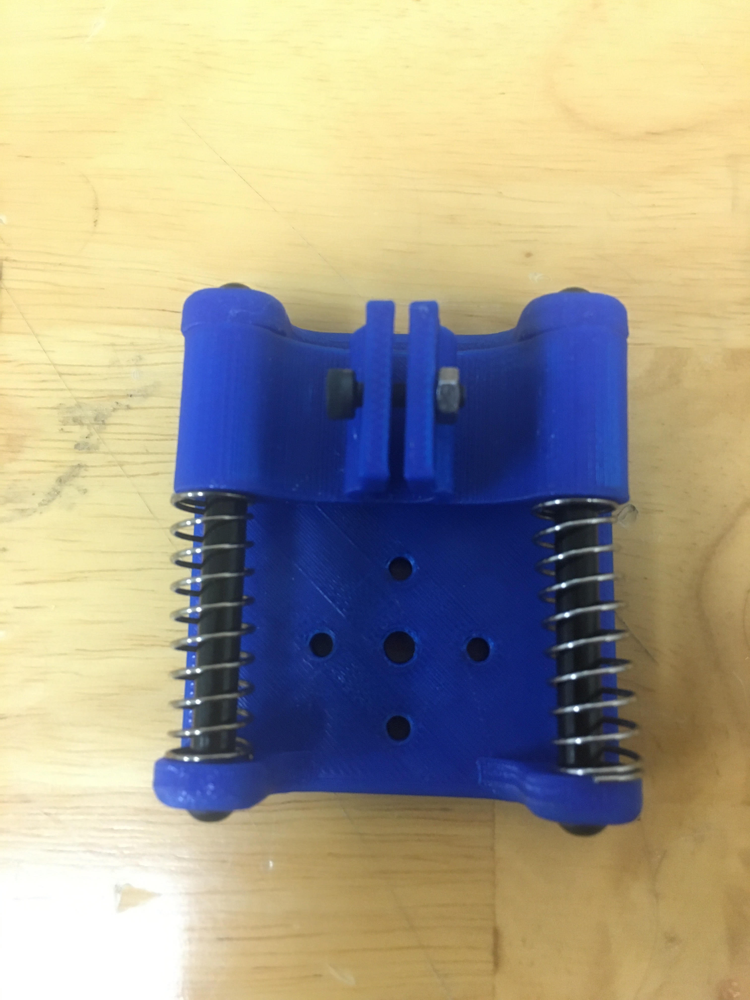
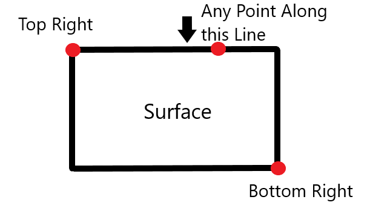

# Tracing an Image

<p align="center">

</p>


<p align="center">
<a href="https://youtu.be/N5IlFthJBqI">Link to Youtube video</a>
</p>


In this document we will go over the setup and the capabilities of the Dorna 2 robot for drawing an image. Dorna 2 robot can replicate any SVG file on any plane. Everything is programmed using python. 
 
You can find the original document here on our website:
https://dorna.ai/blog/dorna-drawing/
## Toolhead Installation
### Parts
We will need to attach the pen holder toolhead. We have the links to the materials below. You can use a 3D printer for two of the parts and you will need to order a few of the materials. Use the default settings when 3D printing and print with a raft. 
|Items|Links|
|---|----|
|2 x 3D printed parts|[link](https://github.com/dorna-robotics/dorna2_otto/tree/main/drawing/STL%20files)|
|9 x M3 10mm length and 1 x M3 bolt|[link](https://www.amazon.com/Sutemribor-320Pcs-Stainless-Button-Assortment/dp/B07CYNKLT2/ref=sr_1_9?dchild=1&keywords=m3+bolt&qid=1623786985&sr=8-9)|
|2 x 35mm springs|[link](https://www.amazon.com/1mmx12mmx35mm-Stainless-Compression-Springs-Connector/dp/B08N6TKX5G/ref=sr_1_1_sspa?dchild=1&keywords=compression+spring+35mm&qid=1623787728&sr=8-1-spons&psc=1&spLa=ZW5jcnlwdGVkUXVhbGlmaWVyPUExTjk1VUI0NU40V1pXJmVuY3J5cHRlZElkPUEwNjgyMTkzMkRHNkJKWFBJNzA0WSZlbmNyeXB0ZWRBZElkPUEwODI5NTkzMlAzSldOU0tDUklISCZ3aWRnZXROYW1lPXNwX2F0ZiZhY3Rpb249Y2xpY2tSZWRpcmVjdCZkb05vdExvZ0NsaWNrPXRydWU=)|
|1 x pen(preferably a Bic pen)|[link](https://www.amazon.com/BIC-Round-Ballpoint-Medium-36-Count/dp/B00347A8NK/ref=sr_1_1_sspa?dchild=1&keywords=bic+pen&qid=1623787158&sr=8-1-spons&psc=1&spLa=ZW5jcnlwdGVkUXVhbGlmaWVyPUEyRTNHV1czWUY3TTRGJmVuY3J5cHRlZElkPUEwMDE4NDEzUkhDN1ZKU1VHT0g5JmVuY3J5cHRlZEFkSWQ9QTA0NDI4OTkyN1RHREZLVUQxSE5IJndpZGdldE5hbWU9c3BfYXRmJmFjdGlvbj1jbGlja1JlZGlyZWN0JmRvTm90TG9nQ2xpY2s9dHJ1ZQ==)|
|2 x 50mm Standoff Column Spacers with 5mm outer diameter|[link](https://www.amazon.com/uxcell-Aluminum-Standoff-Airplane-Quadcopter/dp/B07MJBHKDP/ref=sr_1_3?dchild=1&keywords=standoffs+50mm&qid=1623787093&sr=8-3)|

<p align="center">

</p>

### Construction
Put the smaller 3D printed piece around the shafts and the springs attached as well. If the shaft doesn't slide along the small 3D printed piece it is recommended to sand paper the holes down. Make sure to have the small 3D printed piece oriented to hug the wall farthest from the mount holes on the larger 3D printed piece as shown below. Screw four M3 screws into the ends of the shafts to lock them in. Now attach the part to the Dorna 2 robot by using four M3 screws. Lastly put the pen through the large hole and screw on an M3 bolt and nut. If the pen is too small for the hole. An easy solution can be to wrap it in tape to create a bigger outer diameter for the pen.

<p align="center">

</p>

## Code
### Image
Find an image in SVG format or a file that can be edited in SVG format. You can read into how the SVG format works thanks to [MDN](https://developer.mozilla.org/en-US/docs/Web/SVG/Tutorial/Paths).
### Actions Needed to Run
The language we are commanding the robot in is Python. You will need to download [python](https://www.python.org/downloads/) if you haven't already done so. The line below allows you to connect to your Dorna 2. The IP address needs to be inputted.  [For more information on the API](https://doc.dorna.ai/docs/api/python/manual/).
```python
robot.connect("ip address", 443)
```
Next you will set the width and length of the image you want in mm. This is used to find the ratio of width to length for scaling the image.
```python
#set the width and length in milimeters
width = 200
length= 150
```
The function below generates the set of commands and the amount of commands for the robot to move in a 3D space to draw the image. 'filename.svg' can be changed to choose what SVG file you want to draw. Make sure to have the file in the same directory on your computer.
```python
cmds, cmds_length = svg(10).gen('filename.svg', width, length, 0, 0, a, b, cp, scale, velocity, acceleration, jerk, corner)
```
When the program is run. It will ask you to turn off the motors. Be sure to hold the robot when turning off the motors because it will fall. Then a command will ask you to direct your robot to the left bottom corner of your paper. Be sure to have the toolhead attachment perpendicular to the surface. Not doing so will have the tool attachment going deeper into the surface then desired. Set the pen so it is barely touching the surface. The command will then ask you to direct the robot to the top right of the paper. Lastly you will then direct the robot to a point along the line clockwise of the left bottom coordinate as shown below. A command asking to turn on the motors will come up. After doing so, the Dorna 2 robot will draw the image.

<p align="center">

</p>

This part of the code allows you to change the parameters for a faster drawing or a more precise drawing. Recommendations are given, but the numbers can be changed. The numbers will change the upper limits of the motion parameters.
```python
#the drawing will become slower and more precise by decreasing the numbers below
#the drawing will be drawn faster but less precise by increasing the numbers below
#changing the numbers will change the upper limits of the robots motion parameters
#recommended velocity = 50
velocity = 50
#recommended acceleration = 300
acceleration = 300
#recommended jerk = 3000
jerk = 3000
#recommended corner = 5
corner = 5
```
## Explanation of Code
### Main Function
We can take a look at the main function. This section is at the bottom of the code. The main function starts by connecting to the robot and with user inputs for the width and length the program has a better understanding of the scaling of the iamge.
```python
if __name__ == '__main__':
    robot = dorna()
    print("connecting")
    robot.connect("ip address", 443)
    wait_id = 100
    print("done connecting")
    #set the width and length in mm
    width = 200   
    length = 150
```

Next the starting points are intiliazed by calling a function. With the guidance of the user we can set the 3 points of the paper to understand the size of the paper and to understand the equation of the plane. This is used so if the surface isn't completely flat the program will modify the path to a new plane.

```python
#intialize the 3 points on the plane,Left Bottom-Point along line-Top Right
error, LB, M, TR = startingpoints(robot)
#check if there is an error from last function called
if(error == 1):
print("need to restart")
robot.close()
```
Next we call a function that allows us to find a 3rd corner of the paper. This helps us define the papers width and length and allows the program to have a upper limit for the surfaces width and length in 3D space.
```python
#calls function to find 3rd corner for new plane
TL = findcorner(LB, M, TR)
```
We want to convert all points on an xy axis to a xyz axis given by the plane set. This can be done by a linear formula of

[[x],[y],[z]]= T * [[x0],[y0]] + B

The T stands for transformation and can be solved for because now we have the 3 corners of the plane. T is a 3x2 matrix. B is a 3x1 matrix. B is the starting position's coordinates. 
Next we want to find the perpendicular vector from the plane. This will help to move the robot away from the paper when lifting the pen on a drawing.
```python
#perpendicular vector in unit vector form
cp = perpendicularvector(LB, M, TR)
```
Next is a function that creates the path. This is the bulk of the code. This function creates a xy path from the SVG path provided. The function will then transform the 2D path into a 3D path. The 3D path will then be set in a command form for the robot to understand using cartesian coordinates. 
```python
cmds, cmds_length = svg(10).gen(‘filename.svg', width, length, 0, 0, a, b, cp, scale, velocity, acceleration, jerk, corner)
```
The last few lines of the code takes the list of commands created from the the function above and sends it to the robot to perform. The robot will close and stop moving when the image is done. [For more information on commands](https://doc.dorna.ai/docs/cmd/intro/).
```python
 command_list=[]
 i=0
 stop=True
 while stop:
     for cmd in cmds:
         for c in cmd:
             command_list.append(robot.play(True, **c))
             if len(command_list)==cmds_length[i]:
                 last_continous_point = command_list.pop()
                 status = last_continous_point.complete()
                 command_list=[]
                 if(status == 2):
                     pass
                 else:
                     arg = {"cmd": "halt", "id":1000}
                     robot.play(True, **arg)
                     break
         i+=1
         if len(cmds_length)== i:
             stop=False
 print("done")
 robot.close()
```

